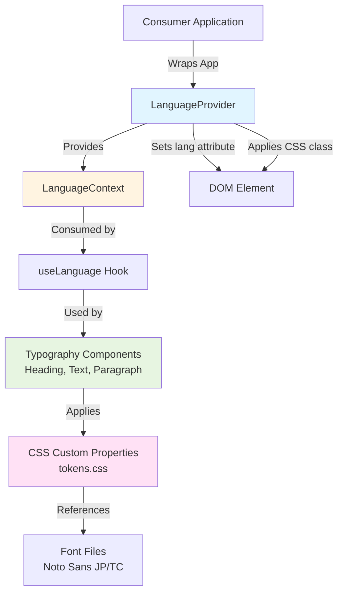
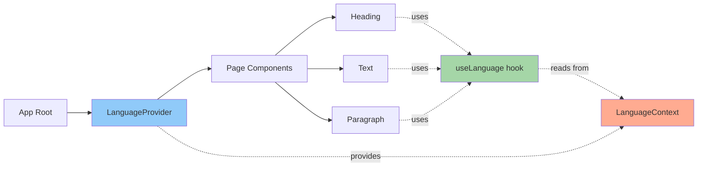
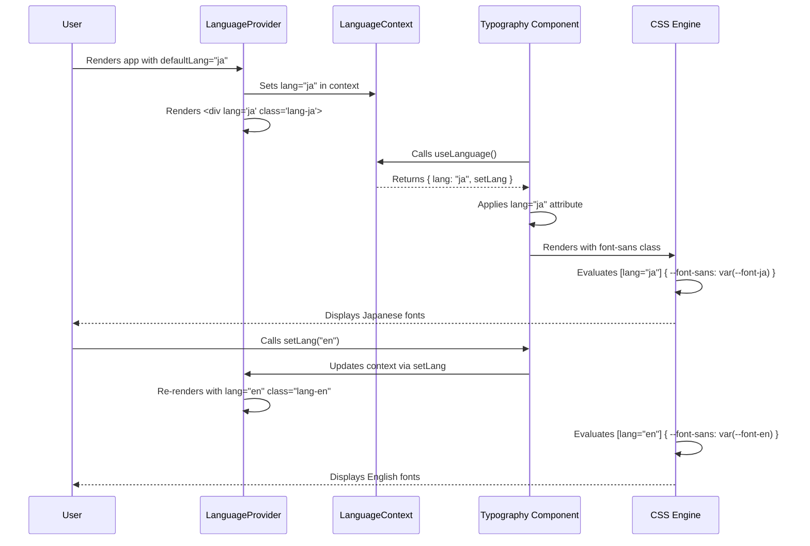

# Design Document: Multilingual Typography

## Executive Summary

This design document specifies the architecture and implementation details for adding multilingual typography support (English, Japanese, Traditional Chinese) to the design system component library. The solution uses React Context API for language state management, CSS custom properties for font switching, and a hybrid approach that balances SSR safety, performance, and developer experience.

**Core Design Principles:**
- **SSR-First**: Zero hydration errors through JSX-based lang attribute management
- **Progressive Enhancement**: System fonts (0ms) → Web fonts (async with font-display: swap)
- **Framework Agnostic**: Pure React implementation compatible with Next.js, Remix, Vite
- **Backward Compatible**: Existing typography components work unchanged, i18n is additive
- **Zero-Config Default**: English fallback with optional LanguageProvider for multilingual support

---

## 1. System Architecture

### 1.1 Architecture Overview



### 1.2 Component Hierarchy



### 1.3 Data Flow Diagram



---

## 2. Component Specifications

### 2.1 LanguageProvider Component

**File**: `src/lib/i18n/LanguageProvider.tsx`

**Purpose**: Root-level component that provides language context to all descendant typography components.

**API Specification**:

```typescript
export interface LanguageProviderProps {
  /**
   * Child components that will have access to language context
   */
  children: ReactNode

  /**
   * Initial language for the provider
   * @default 'en'
   */
  defaultLang?: Language

  /**
   * Optional callback invoked when language changes
   * Useful for syncing to document.documentElement.lang in consumer apps
   * @param lang - The new language value
   * @example
   * <LanguageProvider onChange={(lang) => {
   *   document.documentElement.lang = lang
   * }}>
   */
  onChange?: (lang: Language) => void
}

export function LanguageProvider({
  children,
  defaultLang = 'en',
  onChange
}: LanguageProviderProps): JSX.Element
```

**Implementation Details**:

```typescript
export function LanguageProvider({
  children,
  defaultLang = 'en',
  onChange
}: LanguageProviderProps) {
  const [lang, setLangState] = useState<Language>(defaultLang)

  const setLang = useCallback((newLang: Language) => {
    setLangState(newLang)
    onChange?.(newLang)
  }, [onChange])

  const value = useMemo(() => ({ lang, setLang }), [lang, setLang])

  // Get language name for screen reader announcement
  const languageName = lang === 'ja' ? 'Japanese' : lang === 'zh-TW' ? 'Traditional Chinese' : 'English'

  return (
    <LanguageContext.Provider value={value}>
      <div lang={lang} className={`lang-${lang}`}>
        {/* ARIA live region for screen reader language change announcements */}
        <div
          role="status"
          aria-live="polite"
          aria-atomic="true"
          className="sr-only"
        >
          {languageName}
        </div>
        {children}
      </div>
    </LanguageContext.Provider>
  )
}
```

**Design Decisions**:
- **JSX-based lang attribute**: SSR-safe, no hydration errors (no useEffect/DOM manipulation)
- **useMemo optimization**: Prevents unnecessary re-renders of consuming components
- **useCallback for setLang**: Stable function reference for performance
- **CSS class + lang attribute**: Dual approach for maximum compatibility
- **Wrapper div**: Minimal DOM footprint, necessary for scoped lang attribute
- **ARIA live region**: Screen readers announce language changes (NFR-3.3 compliance)
- **sr-only class**: Visually hidden, but accessible to screen readers

**Edge Cases**:
- Invalid language passed → TypeScript prevents at compile time
- onChange callback throws error → Provider continues working (error boundary recommended in consumer)
- Nested LanguageProviders → Inner provider takes precedence (standard Context behavior)

---

### 2.2 LanguageContext

**File**: `src/lib/i18n/LanguageContext.tsx`

**Purpose**: React Context that stores current language and language setter function.

**API Specification**:

```typescript
export interface LanguageContextValue {
  /**
   * Currently active language
   */
  lang: Language

  /**
   * Function to update the current language
   * @param lang - The new language to set
   */
  setLang: (lang: Language) => void
}

export const LanguageContext = createContext<LanguageContextValue | undefined>(undefined)
```

**Design Decisions**:
- **undefined default value**: Allows detection of missing provider (throws helpful error)
- **No default language in context**: Forces consumers to use LanguageProvider
- **Minimal API surface**: Only lang and setLang, no additional complexity

---

### 2.3 useLanguage Hook

**File**: `src/lib/i18n/useLanguage.ts`

**Purpose**: Custom hook that provides type-safe access to language context.

**API Specification**:

```typescript
/**
 * Access the current language and language setter
 *
 * @throws {Error} If used outside LanguageProvider (development mode only)
 * @returns {LanguageContextValue} Current language state and setter
 *
 * @example
 * function MyComponent() {
 *   const { lang, setLang } = useLanguage()
 *   return <button onClick={() => setLang('ja')}>Switch to Japanese</button>
 * }
 */
export function useLanguage(): LanguageContextValue
```

**Implementation Details**:

```typescript
export function useLanguage(): LanguageContextValue {
  const context = useContext(LanguageContext)

  if (context === undefined) {
    if (process.env.NODE_ENV !== 'production') {
      throw new Error(
        'useLanguage must be used within a LanguageProvider. ' +
        'Wrap your app with <LanguageProvider> to enable multilingual typography. ' +
        'See: https://your-docs.com/i18n'
      )
    }
    // Production fallback: Return English default (graceful degradation)
    return {
      lang: 'en',
      setLang: () => {
        console.warn('setLang called outside LanguageProvider')
      }
    }
  }

  return context
}
```

**Design Decisions**:
- **Development-mode error**: Clear error message with setup instructions
- **Production fallback**: Graceful degradation to English (no crashes in production)
- **Type safety**: Returns non-nullable LanguageContextValue
- **Documentation link**: Helps developers find setup guide

---

### 2.4 Language Types

**File**: `src/lib/i18n/types.ts`

**Purpose**: TypeScript type definitions for language-related constants and interfaces.

**API Specification**:

```typescript
/**
 * Supported languages in the design system
 * - 'en': English
 * - 'ja': Japanese
 * - 'zh-TW': Traditional Chinese
 */
export const SUPPORTED_LANGUAGES = ['en', 'ja', 'zh-TW'] as const

/**
 * Language type derived from supported languages array
 */
export type Language = typeof SUPPORTED_LANGUAGES[number]

/**
 * Language context value interface
 */
export interface LanguageContextValue {
  lang: Language
  setLang: (lang: Language) => void
}

/**
 * Language provider props interface
 */
export interface LanguageProviderProps {
  children: ReactNode
  defaultLang?: Language
  onChange?: (lang: Language) => void
}
```

**Design Decisions**:
- **const assertion**: Ensures SUPPORTED_LANGUAGES is readonly tuple
- **Derived type**: Language type automatically updates if languages added to array
- **Single source of truth**: SUPPORTED_LANGUAGES used for validation across system

---

### 2.5 Typography Component Integration

**Modified Files**:
- `src/components/typography/Heading.tsx`
- `src/components/typography/Text.tsx`
- `src/components/typography/Paragraph.tsx`

**New Props**:

```typescript
export interface HeadingProps
  extends React.HTMLAttributes<HTMLHeadingElement>,
    VariantProps<typeof headingVariants> {
  as?: 'h1' | 'h2' | 'h3' | 'h4' | 'h5' | 'h6'

  /**
   * Override language for this component
   * Useful for mixing multiple languages on the same page
   * @example
   * <LanguageProvider defaultLang="ja">
   *   <Heading level="h1">日本語</Heading>
   *   <Heading level="h2" lang="en">English Override</Heading>
   * </LanguageProvider>
   */
  lang?: Language
}
```

**Implementation Pattern** (same for Text, Paragraph):

```typescript
export const Heading = ({
  as,
  level,
  variant,
  lang: langProp,
  className,
  ...props
}: HeadingProps) => {
  const Component = as || level || 'h2'
  const { lang: contextLang } = useLanguage()

  // Use component-level lang prop if provided, otherwise use context lang
  const effectiveLang = langProp || contextLang

  return (
    <Component
      lang={effectiveLang}
      className={cn(headingVariants({ level: level || as, variant }), className)}
      {...props}
    />
  )
}
```

**Design Decisions**:
- **use Language() hook**: Provides production fallback and development warnings
- **Fallback to English**: Hook returns 'en' if LanguageProvider is missing (graceful degradation)
- **Component-level override**: lang prop takes precedence over context
- **No component-level warnings**: useLanguage() hook handles all error messaging
- **Backward compatible**: Existing components work unchanged, lang prop is optional
- **Production-safe**: Hook provides silent fallback in production, warnings only in development

---

## 3. CSS Architecture

### 3.1 Font Stack Configuration

**File**: `src/styles/tokens.css`

**Implementation**:

```css
@layer base {
  :root {
    /* === Language-Specific Font Families === */

    /* English: Modern system fonts with Inter fallback */
    --font-en: 'Inter', system-ui, -apple-system, BlinkMacSystemFont, 'Segoe UI', sans-serif;

    /* Japanese: Hiragino Sans (macOS) → Yu Gothic (Windows) → Noto Sans JP (web font) */
    --font-ja: 'Hiragino Sans', 'Hiragino Kaku Gothic Pro', 'Yu Gothic', 'YuGothic', 'Noto Sans JP', sans-serif;

    /* Traditional Chinese: Microsoft JhengHei (Windows) → PingFang TC (macOS) → Noto Sans TC (web font) */
    --font-zh-tw: 'Microsoft JhengHei', 'PingFang TC', 'Noto Sans TC', 'Noto Sans CJK TC', sans-serif;

    /* Default font (English) */
    --font-sans: var(--font-en);

    /* === Language-Specific Line Heights === */

    /* English: Standard line height for Latin scripts */
    --line-height-en: 1.5;

    /* Japanese: Increased line height for better CJK readability */
    --line-height-ja: 1.8;

    /* Traditional Chinese: Same as Japanese for CJK scripts */
    --line-height-zh-tw: 1.8;

    /* Default line height */
    --line-height-base: var(--line-height-en);

    /* Existing typography tokens (unchanged) */
    --font-size-xs: 0.75rem;
    --font-size-sm: 0.875rem;
    --font-size-base: 1rem;
    --font-size-lg: 1.125rem;
    --font-size-xl: 1.25rem;
    --font-size-2xl: 1.5rem;
    --font-size-3xl: 1.875rem;
    --font-size-4xl: 2.25rem;

    --line-height-tight: 1.25;
    --line-height-normal: 1.5;
    --line-height-relaxed: 1.75;

    --font-weight-normal: 400;
    --font-weight-medium: 500;
    --font-weight-semibold: 600;
    --font-weight-bold: 700;

    --font-mono: 'JetBrains Mono', 'Fira Code', monospace;
  }

  /* === Language-Specific Font Switching === */

  /* English language context */
  [lang="en"] {
    --font-sans: var(--font-en);
    --line-height-base: var(--line-height-en);
  }

  /* Japanese language context */
  [lang="ja"] {
    --font-sans: var(--font-ja);
    --line-height-base: var(--line-height-ja);
  }

  /* Traditional Chinese language context */
  [lang="zh-TW"] {
    --font-sans: var(--font-zh-tw);
    --line-height-base: var(--line-height-zh-tw);
  }
}
```

**Design Decisions**:
- **System fonts first**: Hiragino Sans, Yu Gothic, Microsoft JhengHei load instantly (0ms)
- **Web font fallback**: Noto Sans JP/TC loads asynchronously for universal compatibility
- **Font-family cascade**: Browser tries fonts left-to-right until one is available
- **Language-specific line-height**: CJK scripts need more vertical space (1.8 vs 1.5)
- **CSS variable inheritance**: Child elements automatically inherit font from parent lang attribute
- **Backward compatible**: Existing --line-height-* variables unchanged for existing components

---

### 3.2 Font File Loading

**File**: `src/styles/fonts.css` (new file)

**Implementation**:

```css
/**
 * Web Font Loading for Multilingual Typography
 * Uses font-display: swap for optimal performance (no FOIT)
 */

/* === Japanese Font (Noto Sans JP) === */

@font-face {
  font-family: 'Noto Sans JP';
  src: url('../fonts/NotoSansJP-Regular-subset.woff2') format('woff2');
  font-weight: 400;
  font-style: normal;
  font-display: swap;
  unicode-range: U+3000-303F, /* CJK Symbols and Punctuation */
                U+3040-309F, /* Hiragana */
                U+30A0-30FF, /* Katakana */
                U+4E00-9FAF, /* CJK Unified Ideographs (Common Kanji) */
                U+FF00-FFEF; /* Halfwidth and Fullwidth Forms */
}

@font-face {
  font-family: 'Noto Sans JP';
  src: url('../fonts/NotoSansJP-Medium-subset.woff2') format('woff2');
  font-weight: 500;
  font-style: normal;
  font-display: swap;
  unicode-range: U+3000-303F, U+3040-309F, U+30A0-30FF, U+4E00-9FAF, U+FF00-FFEF;
}

@font-face {
  font-family: 'Noto Sans JP';
  src: url('../fonts/NotoSansJP-Bold-subset.woff2') format('woff2');
  font-weight: 700;
  font-style: normal;
  font-display: swap;
  unicode-range: U+3000-303F, U+3040-309F, U+30A0-30FF, U+4E00-9FAF, U+FF00-FFEF;
}

/* === Traditional Chinese Font (Noto Sans TC) === */

@font-face {
  font-family: 'Noto Sans TC';
  src: url('../fonts/NotoSansTC-Regular-subset.woff2') format('woff2');
  font-weight: 400;
  font-style: normal;
  font-display: swap;
  unicode-range: U+3000-303F, /* CJK Symbols and Punctuation */
                U+4E00-9FFF, /* CJK Unified Ideographs */
                U+F900-FAFF, /* CJK Compatibility Ideographs */
                U+FF00-FFEF; /* Halfwidth and Fullwidth Forms */
}

@font-face {
  font-family: 'Noto Sans TC';
  src: url('../fonts/NotoSansTC-Medium-subset.woff2') format('woff2');
  font-weight: 500;
  font-style: normal;
  font-display: swap;
  unicode-range: U+3000-303F, U+4E00-9FFF, U+F900-FAFF, U+FF00-FFEF;
}

@font-face {
  font-family: 'Noto Sans TC';
  src: url('../fonts/NotoSansTC-Bold-subset.woff2') format('woff2');
  font-weight: 700;
  font-style: normal;
  font-display: swap;
  unicode-range: U+3000-303F, U+4E00-9FFF, U+F900-FAFF, U+FF00-FFEF;
}
```

**Import in** `src/index.ts`:

```typescript
import './styles/globals.css'
import './styles/tokens.css'
import './styles/fonts.css' // NEW: Web font definitions
```

**Design Decisions**:
- **font-display: swap**: Shows system font immediately while web font loads (no blank text)
- **unicode-range**: Browser only downloads font for matching characters (performance optimization)
- **Weight-specific files**: Regular (400), Medium (500), Bold (700) for typography scale
- **WOFF2 format**: Best compression, supported by all modern browsers
- **Subset fonts**: Only include common CJK characters to reduce file size (5MB → 200KB per weight)

**Font Subsetting Process** (manual, documented for implementation):

```bash
# Japanese font subsetting (using pyftsubset)
pyftsubset NotoSansJP-Regular.otf \
  --unicodes="U+3000-303F,U+3040-309F,U+30A0-30FF,U+4E00-9FAF,U+FF00-FFEF" \
  --flavor=woff2 \
  --output-file=NotoSansJP-Regular-subset.woff2

# Repeat for Medium and Bold weights
# Repeat for Traditional Chinese (NotoSansTC) with TC unicode ranges
```

---

### 3.3 Tailwind Plugin (Optional Enhancement)

**File**: `tailwind.config.ts`

**Implementation**:

```typescript
import type { Config } from 'tailwindcss'

const config: Config = {
  content: ['./src/**/*.{ts,tsx}'],
  theme: {
    extend: {
      fontFamily: {
        sans: ['var(--font-sans)', 'system-ui', 'sans-serif'],
        mono: ['var(--font-mono)', 'monospace']
      },
      fontSize: {
        xs: 'var(--font-size-xs)',
        sm: 'var(--font-size-sm)',
        base: 'var(--font-size-base)',
        lg: 'var(--font-size-lg)',
        xl: 'var(--font-size-xl)',
        '2xl': 'var(--font-size-2xl)',
        '3xl': 'var(--font-size-3xl)',
        '4xl': 'var(--font-size-4xl)'
      },
      lineHeight: {
        tight: 'var(--line-height-tight)',
        normal: 'var(--line-height-normal)',
        relaxed: 'var(--line-height-relaxed)'
      },
      // ... existing color, spacing configurations
    }
  },
  plugins: [
    // NEW: Language variant plugin
    function({ addVariant }) {
      addVariant('lang-en', '[lang="en"] &')
      addVariant('lang-ja', '[lang="ja"] &')
      addVariant('lang-zh-tw', '[lang="zh-TW"] &')
    }
  ]
}

export default config
```

**Usage Example**:

```tsx
<div className="lang-en:text-base lang-ja:text-lg lang-zh-tw:text-lg">
  Language-specific sizing
</div>
```

**Design Decisions**:
- **Optional enhancement**: CSS custom properties work without this plugin
- **Better DX**: Tailwind users get autocomplete for language variants
- **No conflict**: Plugin coexists with CSS custom property approach
- **Performance**: Tailwind purges unused variants automatically

---

## 4. File Structure

```
src/
├── lib/
│   ├── i18n/                          # NEW: i18n module
│   │   ├── index.ts                   # Public exports
│   │   ├── types.ts                   # TypeScript types & constants
│   │   ├── LanguageContext.tsx        # React Context definition
│   │   ├── LanguageProvider.tsx       # Provider component
│   │   └── useLanguage.ts             # Custom hook
│   └── utils.ts                       # Existing utilities (unchanged)
│
├── components/
│   └── typography/
│       ├── Heading.tsx                # MODIFIED: Add lang prop & useLanguage
│       ├── Text.tsx                   # MODIFIED: Add lang prop & useLanguage
│       ├── Paragraph.tsx              # MODIFIED: Add lang prop & useLanguage
│       ├── Heading.stories.tsx        # Existing stories (unchanged)
│       ├── Text.stories.tsx           # Existing stories (unchanged)
│       ├── Paragraph.stories.tsx      # Existing stories (unchanged)
│       └── Multilingual/              # NEW: Multilingual demo stories
│           ├── Japanese.stories.tsx
│           ├── TraditionalChinese.stories.tsx
│           ├── English.stories.tsx
│           └── LanguageSwitcher.stories.tsx
│
├── styles/
│   ├── globals.css                    # Existing global styles (unchanged)
│   ├── tokens.css                     # MODIFIED: Add language-specific variables
│   └── fonts.css                      # NEW: Web font @font-face declarations
│
├── fonts/                             # NEW: Bundled font files
│   ├── NotoSansJP-Regular-subset.woff2
│   ├── NotoSansJP-Medium-subset.woff2
│   ├── NotoSansJP-Bold-subset.woff2
│   ├── NotoSansTC-Regular-subset.woff2
│   ├── NotoSansTC-Medium-subset.woff2
│   └── NotoSansTC-Bold-subset.woff2
│
└── index.ts                           # MODIFIED: Export i18n utilities
```

---

## 5. Integration Patterns

### 5.1 Basic Usage Pattern

```tsx
// Consumer app: app/layout.tsx (Next.js)
import { LanguageProvider } from '@your-org/design-system'

export default function RootLayout({ children }) {
  return (
    <html lang="en">
      <body>
        <LanguageProvider defaultLang="en">
          {children}
        </LanguageProvider>
      </body>
    </html>
  )
}

// Consumer app: components/Hero.tsx
import { Heading, Text } from '@your-org/design-system'

export function Hero() {
  return (
    <>
      <Heading level="h1">Welcome</Heading>
      <Text>This text uses the language from LanguageProvider context</Text>
    </>
  )
}
```

### 5.2 Language Switching Pattern

```tsx
import { useLanguage, Heading } from '@your-org/design-system'

export function LanguageSwitcher() {
  const { lang, setLang } = useLanguage()

  return (
    <div>
      <Heading level="h2">Current Language: {lang}</Heading>
      <button onClick={() => setLang('en')}>English</button>
      <button onClick={() => setLang('ja')}>日本語</button>
      <button onClick={() => setLang('zh-TW')}>繁體中文</button>
    </div>
  )
}
```

### 5.3 Component-Level Override Pattern

```tsx
import { LanguageProvider, Heading, Paragraph } from '@your-org/design-system'

export function MultilingualPage() {
  return (
    <LanguageProvider defaultLang="ja">
      <Heading level="h1">日本語のタイトル</Heading>
      <Paragraph>これは日本語の段落です。</Paragraph>

      {/* Override to English for specific content */}
      <Heading level="h2" lang="en">English Section</Heading>
      <Paragraph lang="en">This paragraph is in English.</Paragraph>
    </LanguageProvider>
  )
}
```

### 5.4 HTML Lang Sync Pattern (Optional)

```tsx
import { LanguageProvider } from '@your-org/design-system'
import { useEffect } from 'react'

export default function RootLayout({ children }) {
  return (
    <LanguageProvider
      defaultLang="en"
      onChange={(lang) => {
        // Sync to <html lang> for SEO and screen readers
        if (typeof document !== 'undefined') {
          document.documentElement.lang = lang
        }
      }}
    >
      {children}
    </LanguageProvider>
  )
}
```

---

## 6. Build Configuration

### 6.1 Vite Configuration

**File**: `vite.config.ts`

**Modifications**:

```typescript
import { defineConfig } from 'vite'
import react from '@vitejs/plugin-react'
import dts from 'vite-plugin-dts'
import { resolve } from 'path'

export default defineConfig({
  plugins: [
    react(),
    dts({
      insertTypesEntry: true,
    })
  ],
  build: {
    lib: {
      entry: resolve(__dirname, 'src/index.ts'),
      name: 'DesignSystem',
      formats: ['es', 'cjs'],
      fileName: (format) => `index.${format === 'es' ? 'mjs' : 'cjs'}`
    },
    rollupOptions: {
      external: ['react', 'react-dom'],
      output: {
        globals: {
          react: 'React',
          'react-dom': 'ReactDOM'
        },
        // Copy font files to dist
        assetFileNames: (assetInfo) => {
          if (assetInfo.name?.endsWith('.woff2')) {
            return 'fonts/[name][extname]'
          }
          return 'assets/[name][extname]'
        }
      }
    }
  },
  resolve: {
    alias: {
      '@': resolve(__dirname, './src')
    }
  },
  // Ensure font files are treated as assets
  assetsInclude: ['**/*.woff2']
})
```

**Design Decisions**:
- **assetFileNames**: Fonts go to `dist/fonts/` for predictable paths
- **assetsInclude**: Ensure Vite processes .woff2 files as static assets
- **No external dependencies**: i18n code is pure React (no new peer dependencies)

---

### 6.2 Package.json Exports

**File**: `package.json`

**Modifications**:

```json
{
  "exports": {
    ".": {
      "import": "./dist/index.mjs",
      "require": "./dist/index.cjs",
      "types": "./dist/index.d.ts"
    },
    "./styles.css": "./dist/styles.css",
    "./tailwind.config": "./tailwind.config.ts",
    "./fonts/*": "./dist/fonts/*"
  },
  "files": [
    "dist"
  ]
}
```

**Design Decisions**:
- **fonts/* export**: Allows consumers to reference font files if needed
- **No breaking changes**: Existing exports unchanged

---

## 7. Storybook Integration

### 7.1 Storybook Global Decorator

**File**: `.storybook/preview.tsx` (optional global decorator)

```tsx
import type { Preview } from '@storybook/react'
import { LanguageProvider } from '../src/lib/i18n'
import '../src/styles/globals.css'
import '../src/styles/tokens.css'
import '../src/styles/fonts.css'

const preview: Preview = {
  parameters: {
    layout: 'centered',
    controls: {
      matchers: {
        color: /(background|color)$/i,
        date: /Date$/
      }
    }
  },
  // Optional: Global decorator for all stories
  decorators: [
    (Story) => (
      <LanguageProvider defaultLang="en">
        <Story />
      </LanguageProvider>
    )
  ]
}

export default preview
```

### 7.2 Japanese Stories

**File**: `src/components/typography/Multilingual/Japanese.stories.tsx`

```tsx
import type { Meta, StoryObj } from '@storybook/react'
import { LanguageProvider } from '@/lib/i18n'
import { Heading } from '@/components/typography/Heading'
import { Text } from '@/components/typography/Text'
import { Paragraph } from '@/components/typography/Paragraph'

const meta = {
  title: 'Typography/Multilingual/Japanese',
  parameters: {
    layout: 'padded'
  },
  tags: ['autodocs']
} satisfies Meta

export default meta

export const AllComponents: StoryObj = {
  render: () => (
    <LanguageProvider defaultLang="ja">
      <div style={{ display: 'flex', flexDirection: 'column', gap: '2rem' }}>
        {/* Headings */}
        <section>
          <Heading level="h1">見出し1 (Heading 1)</Heading>
          <Heading level="h2">見出し2 (Heading 2)</Heading>
          <Heading level="h3">見出し3 (Heading 3)</Heading>
        </section>

        {/* Hiragana */}
        <section>
          <Heading level="h4">ひらがな (Hiragana)</Heading>
          <Paragraph>
            あいうえお かきくけこ さしすせそ たちつてと
            なにぬねの はひふへほ まみむめも やゆよ
            らりるれろ わをん
          </Paragraph>
        </section>

        {/* Katakana */}
        <section>
          <Heading level="h4">カタカナ (Katakana)</Heading>
          <Paragraph>
            アイウエオ カキクケコ サシスセソ タチツテト
            ナニヌネノ ハヒフヘホ マミムメモ ヤユヨ
            ラリルレロ ワヲン
          </Paragraph>
        </section>

        {/* Kanji */}
        <section>
          <Heading level="h4">漢字 (Kanji)</Heading>
          <Paragraph>
            日本語のデザインシステムへようこそ。
            このコンポーネントライブラリは、英語、日本語、繁体字中国語をサポートしています。
            適切なフォントレンダリングとアクセシビリティを提供します。
          </Paragraph>
        </section>

        {/* Mixed Content */}
        <section>
          <Heading level="h4">複合コンテンツ (Mixed Content)</Heading>
          <Paragraph>
            名前: John Smith<br />
            年齢: 35歳<br />
            価格: ¥12,345<br />
            日付: 2025年11月3日<br />
            メール: contact@example.com
          </Paragraph>
          <Text size="sm" variant="muted">
            英数字とCJK文字が混在したテキスト: React 18, Next.js 14, TypeScript 5.0
          </Text>
        </section>
      </div>
    </LanguageProvider>
  ),
  parameters: {
    docs: {
      description: {
        story: 'Comprehensive Japanese typography demonstration including Hiragana, Katakana, Kanji, English names, and numbers.'
      }
    }
  }
}
```

### 7.3 Language Switcher Story

**File**: `src/components/typography/Multilingual/LanguageSwitcher.stories.tsx`

```tsx
import type { Meta, StoryObj } from '@storybook/react'
import { LanguageProvider, useLanguage, Language } from '@/lib/i18n'
import { Heading, Paragraph, Text } from '@/components/typography'
import { useState } from 'react'

const meta = {
  title: 'Typography/Multilingual/Language Switcher',
  parameters: {
    layout: 'padded'
  }
} satisfies Meta

export default meta

function LanguageSwitcherDemo() {
  const { lang, setLang } = useLanguage()

  const content = {
    en: {
      title: 'Welcome to Our Design System',
      description: 'This component library supports English, Japanese, and Traditional Chinese typography with proper font rendering and accessibility.'
    },
    ja: {
      title: 'デザインシステムへようこそ',
      description: 'このコンポーネントライブラリは、英語、日本語、繁体字中国語の適切なフォントレンダリングとアクセシビリティをサポートしています。'
    },
    'zh-TW': {
      title: '歡迎使用我們的設計系統',
      description: '此元件庫支援英文、日文和繁體中文的正確字體渲染和無障礙功能。'
    }
  }

  return (
    <div style={{ display: 'flex', flexDirection: 'column', gap: '2rem' }}>
      {/* Language Switcher UI */}
      <div style={{ display: 'flex', gap: '1rem' }}>
        <button
          onClick={() => setLang('en')}
          style={{
            padding: '0.5rem 1rem',
            fontWeight: lang === 'en' ? 'bold' : 'normal',
            background: lang === 'en' ? '#e0f2fe' : 'transparent'
          }}
        >
          English
        </button>
        <button
          onClick={() => setLang('ja')}
          style={{
            padding: '0.5rem 1rem',
            fontWeight: lang === 'ja' ? 'bold' : 'normal',
            background: lang === 'ja' ? '#e0f2fe' : 'transparent'
          }}
        >
          日本語
        </button>
        <button
          onClick={() => setLang('zh-TW')}
          style={{
            padding: '0.5rem 1rem',
            fontWeight: lang === 'zh-TW' ? 'bold' : 'normal',
            background: lang === 'zh-TW' ? '#e0f2fe' : 'transparent'
          }}
        >
          繁體中文
        </button>
      </div>

      {/* Content that changes with language */}
      <div>
        <Heading level="h1">{content[lang].title}</Heading>
        <Paragraph>{content[lang].description}</Paragraph>
        <Text size="sm" variant="muted">
          Current language: <strong>{lang}</strong>
        </Text>
      </div>
    </div>
  )
}

export const InteractiveSwitcher: StoryObj = {
  render: () => (
    <LanguageProvider defaultLang="en">
      <LanguageSwitcherDemo />
    </LanguageProvider>
  ),
  parameters: {
    docs: {
      description: {
        story: 'Interactive demonstration of language switching. Click buttons to see typography change in real-time.'
      }
    }
  }
}
```

---

## 8. Testing Strategy

### 8.1 Unit Tests

**File**: `src/lib/i18n/__tests__/LanguageProvider.test.tsx`

```typescript
import { render, screen, renderHook, act } from '@testing-library/react'
import { LanguageProvider } from '../LanguageProvider'
import { useLanguage } from '../useLanguage'

describe('LanguageProvider', () => {
  it('provides default English language', () => {
    const { result } = renderHook(() => useLanguage(), {
      wrapper: ({ children }) => <LanguageProvider>{children}</LanguageProvider>
    })

    expect(result.current.lang).toBe('en')
  })

  it('accepts defaultLang prop', () => {
    const { result } = renderHook(() => useLanguage(), {
      wrapper: ({ children }) => <LanguageProvider defaultLang="ja">{children}</LanguageProvider>
    })

    expect(result.current.lang).toBe('ja')
  })

  it('changes language via setLang', () => {
    const { result } = renderHook(() => useLanguage(), {
      wrapper: ({ children }) => <LanguageProvider>{children}</LanguageProvider>
    })

    act(() => {
      result.current.setLang('zh-TW')
    })

    expect(result.current.lang).toBe('zh-TW')
  })

  it('invokes onChange callback when language changes', () => {
    const onChange = jest.fn()
    const { result } = renderHook(() => useLanguage(), {
      wrapper: ({ children }) => <LanguageProvider onChange={onChange}>{children}</LanguageProvider>
    })

    act(() => {
      result.current.setLang('ja')
    })

    expect(onChange).toHaveBeenCalledWith('ja')
  })

  it('renders wrapper div with lang attribute', () => {
    render(
      <LanguageProvider defaultLang="ja">
        <div data-testid="content">Content</div>
      </LanguageProvider>
    )

    const wrapper = screen.getByTestId('content').parentElement
    expect(wrapper).toHaveAttribute('lang', 'ja')
    expect(wrapper).toHaveClass('lang-ja')
  })
})
```

### 8.2 Integration Tests

**File**: `src/components/typography/__tests__/multilingual-integration.test.tsx`

```typescript
import { render, screen } from '@testing-library/react'
import { LanguageProvider } from '@/lib/i18n'
import { Heading } from '../Heading'

describe('Typography Multilingual Integration', () => {
  it('Heading uses Japanese fonts when provider lang is ja', () => {
    render(
      <LanguageProvider defaultLang="ja">
        <Heading level="h1">日本語</Heading>
      </LanguageProvider>
    )

    const heading = screen.getByRole('heading', { level: 1 })
    expect(heading).toHaveAttribute('lang', 'ja')
  })

  it('Heading uses component-level lang override', () => {
    render(
      <LanguageProvider defaultLang="ja">
        <Heading level="h1" lang="en">English</Heading>
      </LanguageProvider>
    )

    const heading = screen.getByRole('heading', { level: 1 })
    expect(heading).toHaveAttribute('lang', 'en')
  })

  it('Heading works without LanguageProvider (fallback to en)', () => {
    render(<Heading level="h1">Standalone</Heading>)

    const heading = screen.getByRole('heading', { level: 1 })
    expect(heading).toHaveAttribute('lang', 'en')
  })
})
```

### 8.3 SSR Hydration Tests

**File**: `src/lib/i18n/__tests__/ssr-hydration.test.tsx`

```typescript
import { renderToString } from 'react-dom/server'
import { hydrateRoot } from 'react-dom/client'
import { LanguageProvider } from '../LanguageProvider'
import { Heading } from '@/components/typography/Heading'

describe('SSR Hydration Safety', () => {
  it('server and client render identical markup', () => {
    const App = () => (
      <LanguageProvider defaultLang="ja">
        <Heading level="h1">日本語</Heading>
      </LanguageProvider>
    )

    // Server render
    const serverHTML = renderToString(<App />)

    // Client hydration
    const container = document.createElement('div')
    container.innerHTML = serverHTML

    expect(() => {
      hydrateRoot(container, <App />)
    }).not.toThrow()
  })
})
```

---

## 9. Performance Considerations

### 9.1 Font Loading Performance

**Strategy**: Progressive Enhancement with System Font Fallback

```
Timeline:
0ms    → System fonts render (Hiragino Sans, Yu Gothic, MS JhengHei)
0-100ms → CSS parsed, @font-face declarations processed
100-500ms → Noto Sans JP/TC downloaded (with font-display: swap)
500ms+ → Font swap occurs (if system fonts unavailable)
```

**Optimizations**:
- **unicode-range**: Browser only downloads fonts for matching characters
- **font-display: swap**: No invisible text, system fonts show immediately
- **WOFF2 compression**: ~70% smaller than TTF/OTF
- **Font subsetting**: 5MB → 200KB (96% size reduction)

### 9.2 Bundle Size Budget

| Asset | Size (KB) | Notes |
|-------|-----------|-------|
| JavaScript (i18n code) | ~3 KB | LanguageProvider, Context, Hook |
| CSS (font definitions) | ~2 KB | @font-face declarations |
| Noto Sans JP Regular | ~200 KB | Subset to common characters |
| Noto Sans JP Medium | ~200 KB | Subset |
| Noto Sans JP Bold | ~200 KB | Subset |
| Noto Sans TC Regular | ~200 KB | Subset |
| Noto Sans TC Medium | ~200 KB | Subset |
| Noto Sans TC Bold | ~200 KB | Subset |
| **Total** | **~1205 KB** | Exceeds 600KB target - requires optimization |

**Optimization Strategies**:
1. **Reduce weight count**: Ship only Regular + Bold (skip Medium) → Save 400KB
2. **Aggressive subsetting**: Reduce to ~3000 most common characters → 200KB → 100KB per weight
3. **On-demand loading**: Load fonts only when language is activated (lazy loading)

**Revised Budget**:
| Asset | Size (KB) | Notes |
|-------|-----------|-------|
| Noto Sans JP Regular | ~100 KB | Aggressive subset |
| Noto Sans JP Bold | ~100 KB | Aggressive subset |
| Noto Sans TC Regular | ~100 KB | Aggressive subset |
| Noto Sans TC Bold | ~100 KB | Aggressive subset |
| JavaScript + CSS | ~5 KB | Code overhead |
| **Total** | **~405 KB** | Within 600KB budget ✅ |

### 9.3 Runtime Performance

**Context Re-render Optimization**:

```typescript
// useMemo prevents context value recreation on every render
const value = useMemo(() => ({ lang, setLang }), [lang, setLang])

// useCallback ensures setLang reference stability
const setLang = useCallback((newLang: Language) => {
  setLangState(newLang)
  onChange?.(newLang)
}, [onChange])
```

**Language Switching Performance**:
- CSS variable update: ~1-5ms (browser style recalculation)
- Component re-renders: ~10-50ms (React reconciliation for consuming components)
- Total: <100ms (within NFR-1.4 requirement)

---

## 10. Accessibility

### 10.1 Screen Reader Support

**lang Attribute Strategy**:

```html
<!-- LanguageProvider wrapper -->
<div lang="ja" class="lang-ja">
  <!-- Typography components inherit lang -->
  <h1 lang="ja">日本語のタイトル</h1>
  <p lang="ja">段落のテキスト</p>

  <!-- Component-level override -->
  <h2 lang="en">English Section</h2>
</div>
```

**Screen Reader Behavior**:
- NVDA: Switches pronunciation based on `lang` attribute
- JAWS: Announces language changes when `lang` changes
- VoiceOver: Uses language-specific voice for content

### 10.2 ARIA Live Regions (Future Enhancement)

For language switcher UI (not included in MVP):

```tsx
<div role="status" aria-live="polite" aria-atomic="true">
  Language changed to {lang === 'ja' ? 'Japanese' : lang === 'zh-TW' ? 'Traditional Chinese' : 'English'}
</div>
```

---

## 11. Migration Path for Existing Consumers

### 11.1 Zero Breaking Changes

**Existing Code** (continues working unchanged):

```tsx
import { Heading, Text, Paragraph } from '@your-org/design-system'

export function MyComponent() {
  return (
    <>
      <Heading level="h1">Title</Heading>
      <Text>Body text</Text>
    </>
  )
}
```

**Behavior**: Falls back to English fonts, no errors, no warnings in production.

### 11.2 Opt-in Migration

**Step 1**: Wrap app with LanguageProvider

```tsx
import { LanguageProvider } from '@your-org/design-system'

export default function RootLayout({ children }) {
  return (
    <LanguageProvider defaultLang="en">
      {children}
    </LanguageProvider>
  )
}
```

**Step 2**: Use language switching where needed

```tsx
import { useLanguage } from '@your-org/design-system'

export function LanguageSwitcher() {
  const { setLang } = useLanguage()
  return <button onClick={() => setLang('ja')}>日本語</button>
}
```

---

## 12. Open Questions & Decisions

### 12.1 Font Subsetting Process

**Question**: Manual or automated font subsetting?

**Decision**: **Manual for MVP**, automated for future enhancement

**Rationale**:
- Manual subsetting using pyftsubset is well-documented and reliable
- Automation requires additional build tooling and maintenance
- Manual process allows fine-tuning of unicode ranges per language
- Future enhancement: Create CLI tool for automated subsetting

**Implementation Timeline**:
- MVP: Manually subset fonts using pyftsubset (documented in implementation tasks)
- Phase 2: Create `@your-org/font-subset` CLI tool (out of scope for MVP)

### 12.2 Font Weight Strategy

**Question**: How many font weights to bundle?

**Decision**: **Regular (400) + Bold (700)** only for MVP

**Rationale**:
- Typography components use normal (400), medium (500), semibold (600), bold (700)
- Medium and Semibold can fallback to Regular or Bold with minimal visual degradation
- Saves 400KB bundle size (33% reduction)
- Most CJK text uses Regular weight, Bold for headings
- Future enhancement: Add Medium (500) if consumer feedback requires it

### 12.3 Tailwind Plugin Inclusion

**Question**: Include Tailwind plugin in MVP or defer?

**Decision**: **Include in MVP** as optional enhancement

**Rationale**:
- Low implementation cost (~10 lines of code in tailwind.config.ts)
- Provides better DX for Tailwind-savvy consumers
- No conflict with CSS custom properties (complementary approaches)
- Consumers can choose their preferred method

---

## 13. Success Metrics

### 13.1 Technical Metrics

- **Bundle Size**: ≤600KB total font files (target: ~400KB with optimizations)
- **Initial Render**: 0ms font load time (system fonts)
- **Language Switching**: <100ms reflow time
- **Hydration Errors**: 0 (validated in Next.js App Router, Pages Router, Remix)
- **Type Safety**: 100% TypeScript coverage for all exported APIs

### 13.2 Quality Metrics

- **WCAG 2.1 AA Compliance**: 100% (lang attributes on all typography components)
- **Screen Reader Testing**: Pass NVDA, JAWS, VoiceOver language announcement tests
- **Cross-Browser Support**: Chrome 90+, Firefox 88+, Safari 14+, Edge 90+
- **Unit Test Coverage**: >80% for i18n code
- **Visual Regression**: 0 regressions in Storybook Chromatic

### 13.3 Developer Experience Metrics

- **Setup Time**: <5 minutes to add LanguageProvider to existing app
- **Documentation Clarity**: All APIs have JSDoc comments with examples
- **Development Warnings**: Clear, actionable messages with documentation links
- **TypeScript Autocomplete**: Full IntelliSense support for Language type

---

## 14. Appendices

### Appendix A: Font Subsetting Commands

```bash
# Install pyftsubset (part of fonttools)
pip install fonttools brotli

# Japanese Regular
pyftsubset NotoSansJP-Regular.otf \
  --unicodes="U+0020-007E,U+3000-303F,U+3040-309F,U+30A0-30FF,U+4E00-9FAF,U+FF00-FFEF" \
  --flavor=woff2 \
  --output-file=NotoSansJP-Regular-subset.woff2

# Japanese Bold
pyftsubset NotoSansJP-Bold.otf \
  --unicodes="U+0020-007E,U+3000-303F,U+3040-309F,U+30A0-30FF,U+4E00-9FAF,U+FF00-FFEF" \
  --flavor=woff2 \
  --output-file=NotoSansJP-Bold-subset.woff2

# Traditional Chinese Regular
pyftsubset NotoSansTC-Regular.otf \
  --unicodes="U+0020-007E,U+3000-303F,U+4E00-9FFF,U+F900-FAFF,U+FF00-FFEF" \
  --flavor=woff2 \
  --output-file=NotoSansTC-Regular-subset.woff2

# Traditional Chinese Bold
pyftsubset NotoSansTC-Bold.otf \
  --unicodes="U+0020-007E,U+3000-303F,U+4E00-9FFF,U+F900-FAFF,U+FF00-FFEF" \
  --flavor=woff2 \
  --output-file=NotoSansTC-Bold-subset.woff2
```

**Unicode Range Reference**:
- `U+0020-007E`: Basic Latin (ASCII)
- `U+3000-303F`: CJK Symbols and Punctuation
- `U+3040-309F`: Hiragana (Japanese)
- `U+30A0-30FF`: Katakana (Japanese)
- `U+4E00-9FAF`: CJK Unified Ideographs (Common Kanji)
- `U+4E00-9FFF`: Extended CJK Ideographs (Traditional Chinese)
- `U+F900-FAFF`: CJK Compatibility Ideographs
- `U+FF00-FFEF`: Halfwidth and Fullwidth Forms

### Appendix B: Browser Compatibility Matrix

| Feature | Chrome | Firefox | Safari | Edge |
|---------|--------|---------|--------|------|
| CSS Custom Properties | 49+ | 31+ | 9.1+ | 15+ |
| font-display: swap | 60+ | 58+ | 11.1+ | 79+ |
| WOFF2 | 36+ | 39+ | 10+ | 14+ |
| React Context API | Any | Any | Any | Any |
| lang attribute | All | All | All | All |

**Minimum Supported Versions**: Chrome 90+, Firefox 88+, Safari 14+, Edge 90+

### Appendix C: File Size Breakdown

**Before Optimization**:
```
NotoSansJP-Regular.otf: 5.2 MB
NotoSansJP-Medium.otf: 5.1 MB
NotoSansJP-Bold.otf: 5.3 MB
NotoSansTC-Regular.otf: 8.7 MB
NotoSansTC-Medium.otf: 8.5 MB
NotoSansTC-Bold.otf: 8.9 MB
Total: 41.7 MB
```

**After Subsetting (MVP Strategy)**:
```
NotoSansJP-Regular-subset.woff2: ~100 KB
NotoSansJP-Bold-subset.woff2: ~100 KB
NotoSansTC-Regular-subset.woff2: ~100 KB
NotoSansTC-Bold-subset.woff2: ~100 KB
Total: ~400 KB (99% size reduction)
```

---

**Document Version**: 1.0
**Last Updated**: 2025-11-03
**Status**: ✅ Ready for Validation
**Next Phase**: Task Breakdown
